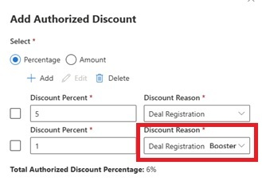

# Deal Reg Booster 1 and 2 - One Pager

## Summary
*Deal registration booster for 1% and 2% need to be added to the Authorized Discount drop down list.  New deal reg customers often get an extra 1% or 2% discount, the business would like that reflected on the quote summary pricing*

---

## Business Need
**Problem Statement:**  
*Currently as a work around, the advocates have to select Deal Registration for authorized manual discount and add it a 2nd time for the extra booster. There should be a DEAL REG BOOSTER option to choose from in the drop down list so they can add 1% OR 2% and have that display in the CASE pricing summary with the Deal Registration discount.*

**Impact:**  
*Clarity and accuracy the CASE quoting process.*

---

## Solution Overview
*The UI for this change is to see the Deal Reg Booster in the drop down list and also as a label next to the applied discount on the quote, just like Deal Registration.  *

---

## Key Features/Components
- Feature 1: *Add 
Deal Registration Booster to authorized discount drop down list to select*
- Feature 2: *Deal Registration Booster Should be part of the discount calculation just like Deal Registration*
- Feature 3: *The label on the pricing summary of the quote should show Deal Registration Booster*

---

**Document Owner:** *Sarah Richey v-sarichey@microsoft.com*  
**Last Updated:** October 6, 2025
